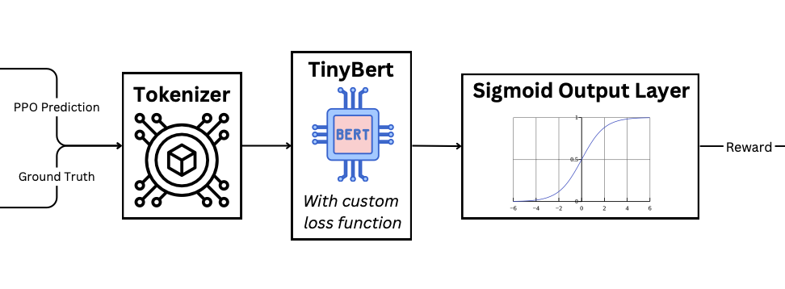
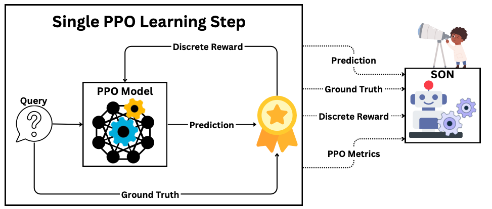
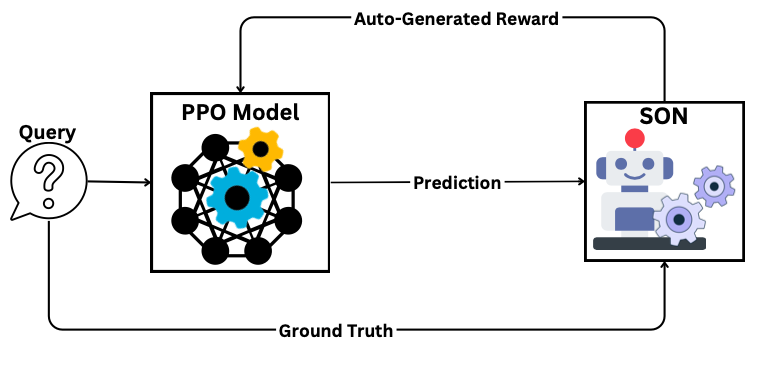
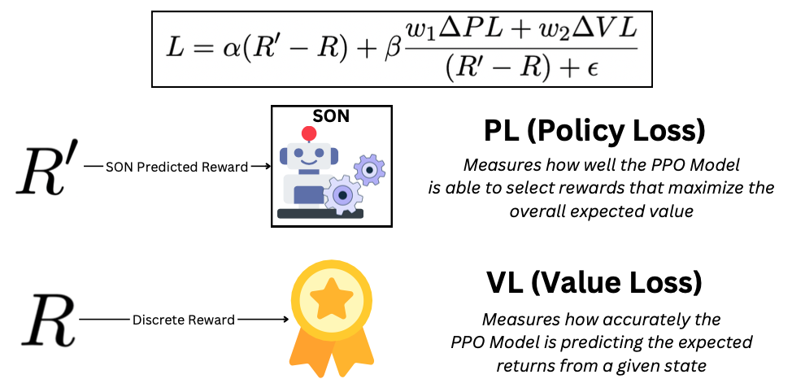
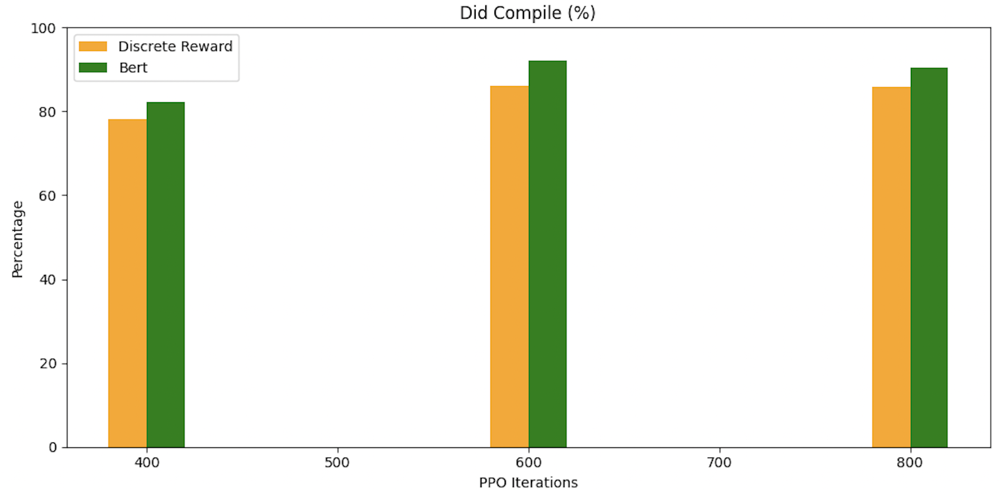
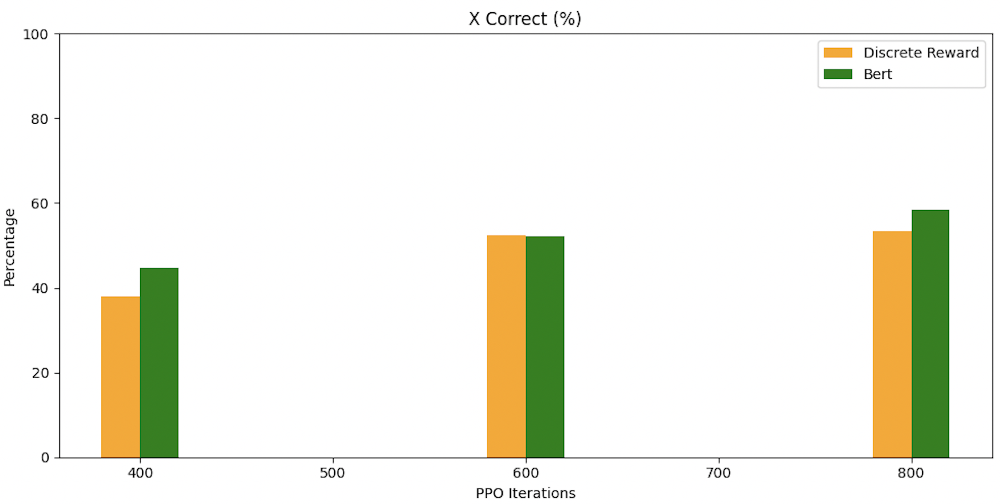
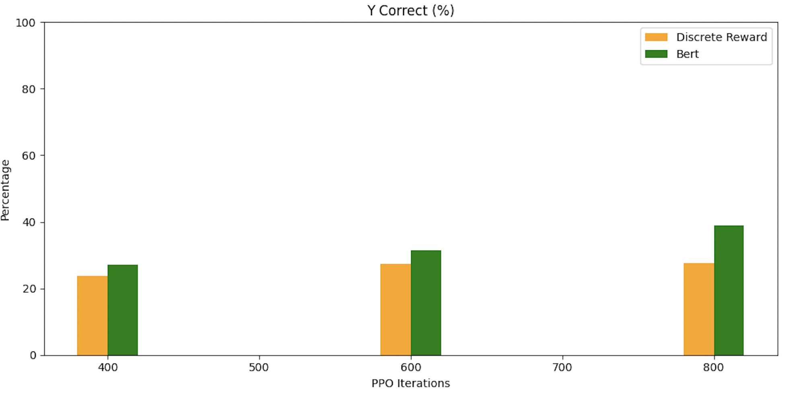

# Like Father Like SON
**Automatically Generating Rewards for PPO-Based Visualization Recommendation Systems**

> My master's thesis exploring how to improve reinforcement learning for NL-to-Visualization systems using a Stable Observer Network (SON).

---

## Overview

Training reinforcement learning models to generate effective visualizations from natural language input is hard — especially when defining rewards is subjective and expensive.

This project proposes a **Stable Observer Network (SON)** — a lightweight transformer-based model that learns how the PPO agent responds to rewards, then takes over to generate more stable, adaptive reward signals. 

It was built and tested in Amazon SageMaker using the [NVBench](https://github.com/vis-nlp/NVBench) dataset and a modified LLaMA model.

---

## Architecture

Our Stable Observer Network (SON) is designed to observe PPO training behavior and learn how to generate rewards that improve convergence.

---

### SON Model Overview

The SON consists of a TinyBERT model with a custom loss function, trained to produce continuous reward values from PPO predictions and ground truth pairs.

---

### Observation Phase

During the first 200 PPO learning steps, SON observes the PPO model's behavior using:

- Discrete rewards
- PPO metrics (policy loss, value loss, KL divergence)

This phase helps SON learn how to model rewards before taking over.

---

### Inference Phase

Once trained, SON takes over as the sole reward model — generating smooth, feedback-driven rewards based on model behavior.

---

### Custom Loss Function

The SON is trained using a **custom reward regression loss** that incorporates PPO feedback. This balances how closely SON matches the discrete reward (`R`) with how it impacts the PPO’s performance (`ΔPL`, `ΔVL`):

$$
L = \alpha (R' - R) + \beta \frac{w_1 \Delta PL + w_2 \Delta VL}{(R' - R) + \epsilon}
$$

Where:
- `R'` = SON’s predicted reward
- `R` = discrete reward from original labeling
- `PL` = policy loss
- `VL` = value loss

This lets SON learn not just to mimic discrete labels, but to improve PPO performance directly.

---

## Results

#### Final Output Quality

#### X-Axis Prediction Accuracy

#### Y-Axis Prediction Accuracy

---

## Files

- `Lamma3-finetune.ipynb` - initial fine-tune before we start PPO Learning
- `SON.ipynb` – full implementation in a cleaned-up notebook
- `Dissertation.pdf` – thesis defense presentation
- `like-father-like-son-thesis.pdf` – full master's thesis document
- `assets/` – diagrams and result graphs used in this README
- `reaserch/` - any continued reaserch I have conducted after the thesis was done

---

## Full Thesis

For in-depth methodology, experiments, and math:

[Like Father Like SON – Master's Thesis (PDF)](./Thesis.pdf)

---

## Built With

- Hugging Face Transformers (TinyBERT)
- PPO from HuggingFace RLHF
- NVBench Dataset
- Amazon SageMaker

---

## Ongoing Work

Check out my personal research logs in [`/research`](./research):

- Prompt engineering with LLaMA 3.0
- Chain-of-thought attempts
- ChatGPT-generated rewards for PPO

---

## Author

**Raffaele Leo**  
Raff1343@gmail.com

---

## 📝 License

MIT License — free to use and adapt.

